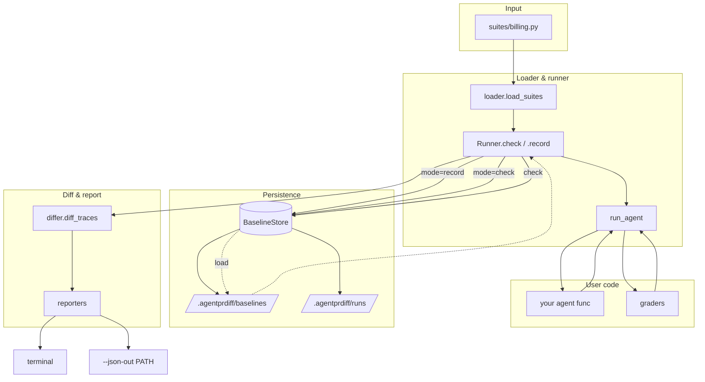

# Architecture Deep Dive

`agentprdiff` is intentionally small — about 1,500 lines of Python in
`src/agentprdiff/`. This page is a guided tour of the modules, the
execution flow, and the design tradeoffs.

## Module map

```
src/agentprdiff/
├── __init__.py         # Public façade — re-exports the stable API
├── core.py             # Data model: Suite, Case, Trace, LLMCall, ToolCall, GradeResult
├── runner.py           # Orchestration: Runner, RunReport, CaseReport
├── differ.py           # Trace comparison: TraceDelta, AssertionChange, diff_traces
├── store.py            # Filesystem persistence: BaselineStore
├── loader.py           # Importing user suite files
├── filtering.py        # --case / --skip pattern parsing & application
├── reporters.py        # TerminalReporter, JsonReporter, ReviewReporter
├── scaffold.py         # `agentprdiff scaffold` templates
├── cli.py              # Click app — wires the above into commands
├── graders/
│   ├── __init__.py     # Public grader exports
│   ├── deterministic.py# contains, regex_match, tool_called, ...
│   └── semantic.py     # semantic(), fake_judge, openai_judge, anthropic_judge
└── adapters/
    ├── __init__.py     # Pricing re-exports
    ├── pricing.py      # DEFAULT_PRICES, register_prices, estimate_cost_usd
    ├── openai.py       # OpenAI / OpenAI-compatible (sync + async)
    └── anthropic.py    # Anthropic Messages API (sync only today)
```

## Data flow



## Execution timeline (one `agentprdiff check`)

1. **CLI bootstrap.** `cli.main` instantiates a `BaselineStore` (root
   defaults to `.agentprdiff`).
2. **Load.** `cli.cmd_check` calls `loader.load_suites(SUITE_FILE)`. The
   loader inserts the suite's parent dir and `cwd` into `sys.path`,
   imports the file, and harvests every module-level `Suite`. Inserted
   paths are removed on the way out.
3. **Filter.** If `--case` / `--skip` were passed, `filtering.parse_patterns`
   tokenizes them and `filtering.apply_filter` returns a *new* list of
   `Suite`s with narrowed `cases`. Zero-match exits 2.
4. **Per-suite loop.** For each surviving `Suite`:
   1. `Runner.check` calls `BaselineStore.ensure_initialized` and
      `BaselineStore.fresh_run_id`.
   2. For each `Case`:
      1. `core.run_agent` invokes the agent, building a `Trace` (or
         capturing the agent-returned trace, or capturing an exception).
      2. `case.expect` graders are evaluated against the new trace; each
         returns a `GradeResult`.
      3. `BaselineStore.save_run_trace(run_id, trace)` writes the new
         trace to `runs/<run_id>/<suite>/<case>.json`.
      4. `BaselineStore.load_baseline(suite, case)` loads the committed
         baseline if it exists.
      5. *If a baseline exists*, the same graders are replayed against it
         to get baseline-pass states.
      6. `differ.diff_traces` computes a `TraceDelta` from baseline +
         current + grader results.
      7. A `CaseReport` is appended to the suite's `RunReport`.
   3. `TerminalReporter.render(report)` prints the table.
   4. If `--json-out` was passed, `JsonReporter.render(report, path)`
      writes the JSON envelope.
5. **Aggregate exit.** The CLI exits 1 iff any `RunReport.has_regression`
   is true; otherwise 0.

`record` mode is identical except (a) baselines are written instead of
loaded, and (b) the differ is skipped.

## Design choices worth knowing

### A grader is just a function

`Grader = Callable[[Trace], GradeResult]`. No abstract base class. Lambdas
are fine. Custom graders ship as small functions in your suite file.
Nothing about a grader is registered globally — `expect=[my_grader]` is
the entire surface.

### Baselines are JSON files in your repo

```
.agentprdiff/baselines/<suite>/<case>.json
```

Pretty-printed, schema-stable, designed for git diffs. The whole point of
the store is that humans review trace changes in PRs the same way they
review code changes. We considered SQLite, a hosted service, content-
addressed blobs in git LFS — and rejected all of them for the same
reason: they make the diff invisible.

### Suite files are Python, not YAML

A suite is `cases=[case(...), ...]`. Cases are parameterized in Python
because:

- Lists of strings get formatted with `black` for free.
- Custom graders, judges, helpers, and test fixtures sit naturally
  alongside cases.
- IDE autocompletion works.
- A `for` loop generates dozens of cases without YAML anchor gymnastics.

The cost is that a malformed suite raises a Python error on import —
that's fine, it's a developer-facing tool.

### Adapters monkey-patch one bound method

`instrument_client(client)` patches `client.chat.completions.create` (or
`client.messages.create` for Anthropic). The patch is bound to the *client
instance*, not the SDK module. Two parallel agents with their own clients
don't interfere with each other; restoring on `__exit__` is a one-line
swap; nesting works.

We considered subclassing the SDK clients (more idiomatic in some
languages) and decided against it because it forces every adopter to swap
their constructor — a change to *every call site* instead of one `with`
block.

### Async detected at entry, not declared

`instrument_client` checks `asyncio.iscoroutinefunction(create)` once and
installs the right shape of patched method. The `with` block stays a
regular `with`; you don't pick a "sync vs async" entry point. This is
because the patch's lifetime is tied to the client instance, not the
event loop.

### `review` always exits 0

`agentprdiff check` is for CI. `agentprdiff review` is for the inner
loop. Same comparison logic, different exit semantics — the way `pytest
-k` lets you focus on a single test without changing how `pytest` itself
exits. The yellow "regressed" footer is the visual signal in `review`,
not the exit code.

### Cost is computed, not measured

The bundled `DEFAULT_PRICES` table maps model IDs to per-1k-token prices.
The adapters multiply by the response's `usage` object. We pick computed
cost over reading provider invoices because (a) you want to gate cost in
CI, before the invoice arrives, and (b) provider invoices don't bucket
spend by case anyway.

When a model is missing from the table, `cost_usd` is recorded as `0.0`
and one `RuntimeWarning` is emitted per process — loud enough to fix,
quiet enough to not flood logs.

### `fake_judge` exists so CI stays green without API keys

The default judge selection chooses `fake_judge` (deterministic keyword
matching) when no `OPENAI_API_KEY` / `ANTHROPIC_API_KEY` is set. This is
intentional — `agentprdiff` is meant to *always* run on every PR, and
demanding API keys for the first commit is a fast way to get the suite
turned off. The reporter prints a yellow banner reminding you the silent
fallback is in effect, so it can never quietly bit-rot.

### Graders are evaluated against both traces

To compute *which* assertion regressed, the runner re-runs the case's
graders against the loaded baseline. This is a tradeoff: baseline JSON
doesn't store grader results, only the trace, so the grader has to be
the same callable across both runs (which it is, because both runs use
the same `case.expect` list). The alternative (storing grader results in
the baseline) was rejected because it would force a migration on every
grader change.

## Key invariants

- A `Trace` is JSON-serializable. Every field round-trips through
  `model_dump_json` / `model_validate_json`.
- A `GradeResult.grader_name` uniquely identifies the assertion within a
  case. Reporters and the differ key off it.
- `BaselineStore.save_baseline` overwrites in place. The differ never
  *appends* to baseline JSON.
- `BaselineStore.fresh_run_id` returns ISO-8601 with second precision —
  unique enough for human inspection, sortable, gitignored as a folder.
- `Runner.check` *always* writes the run trace, even when no baseline
  exists. That makes "the run before I ran `record` for the first time"
  inspectable.

## Limitations

- **No parallel case execution.** Cases run serially per suite. If you
  have 200 cases that each take 5s of network time, that's 17 minutes.
  Parallelism is on the roadmap.
- **No streaming reporter.** The whole `RunReport` is built before
  rendering. Long suites print nothing until they finish.
- **Baselines are not versioned.** A baseline from `agentprdiff 0.1`
  with a different schema would fail to load in 0.2. We bump the minor
  version to signal that and update `Trace` defensively. PRs across
  major bumps need re-recorded baselines.
- **No remote store.** `BaselineStore` is filesystem-only. Subclass it if
  you need S3 / GCS / database — see
  [Customization](./usage/customization.md#plugging-a-custom-store-backend).
- **No scheduled re-records.** Drift over time (model providers
  silently nudging behavior) is not auto-detected.
