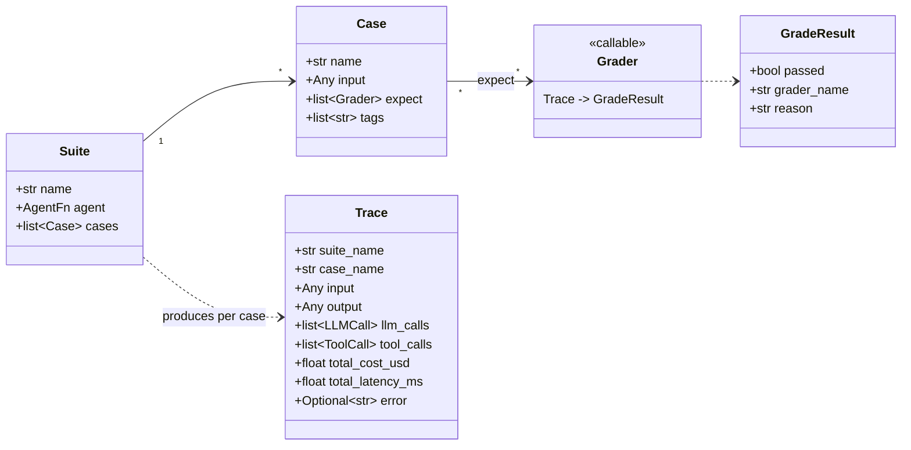
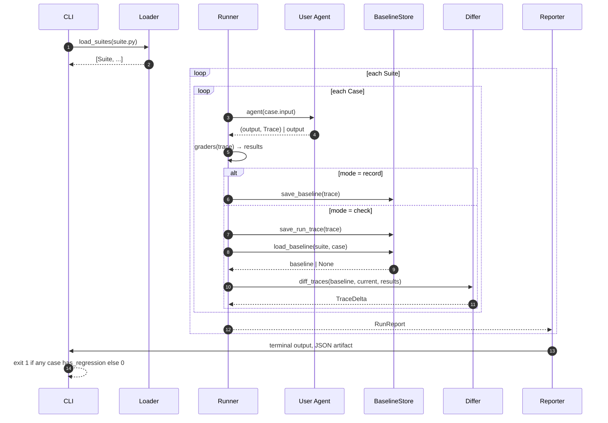

# Core Concepts

`agentprdiff` has a small vocabulary. Internalize these five nouns and the
rest of the docs read like glue.

## The five nouns



### Suite

A named group of `Case`s sharing one agent under test. Built with the
`suite(name=, agent=, cases=, description=)` factory.

### Case

One input, plus the assertions that must hold for the resulting trace.
Built with `case(name=, input=, expect=, tags=)`.

### Trace

The complete record of one agent run. JSON-serializable, designed to be
written to disk as a baseline and compared across versions of your agent.
Tracks:

- the original `input` and final `output`,
- every `LLMCall` (provider, model, tokens, cost, latency, output text),
- every `ToolCall` (name, arguments, result, latency, error),
- aggregate metrics (`total_cost_usd`, `total_latency_ms`, etc.),
- a top-level `error` if the agent raised.

### Grader

Any callable `(Trace) -> GradeResult`. Ten built-ins ship with the package;
you can add your own by writing a function. See
[Graders reference](./api/graders.md).

### GradeResult

`{passed: bool, grader_name: str, reason: str}`. The reason is what shows
up in the terminal table when an assertion fails — write reasons that are
useful to a future on-call engineer.

## How a run flows internally



## The four objects on disk

```
.agentprdiff/
├── baselines/                              ← committed
│   └── <suite_name>/
│       └── <case_name>.json                ← the canonical Trace
└── runs/                                   ← gitignored
    └── 20260425T195727Z/                   ← timestamped per check
        └── <suite_name>/
            └── <case_name>.json            ← the run's Trace
```

- `baselines/` is **the contract**. It's a JSON snapshot of a `Trace`,
  pretty-printed for readable git diffs.
- `runs/` is the audit trail of recent local executions. It's gitignored by
  default, never reaches CI, and is safe to delete with
  `rm -rf .agentprdiff/runs/`.

A `--json-out PATH` flag on `record` and `check` writes a *single* report
file at `PATH` (overwriting on every run). That's the artifact you upload
in CI for downstream automation.

## What "regression" means

A case is flagged as a regression when **any** of the following are true:

| Cause | Detected by |
|---|---|
| A grader that previously passed now fails | `AssertionChange.is_regression` |
| The agent raised in the current run, but not in baseline | `TraceDelta.has_regression` |
| There is no baseline yet, *and* any current grader failed | `CaseReport.has_regression` (first-run-bad is still bad) |

`CaseReport.has_regression` is the per-case answer.
`RunReport.has_regression` is `any(c.has_regression for c in cases)`.
The CLI maps this to a process exit code: `1` for any regression, `0`
otherwise. `agentprdiff review` always exits `0` regardless — it's a
local-iteration tool, not a CI gate.

## Cost / latency / tokens are diffed too

Even if every assertion still passes, the differ records:

- `cost_delta_usd` — change in total cost since baseline.
- `latency_delta_ms` — change in total latency since baseline.
- `prompt_tokens_delta` / `completion_tokens_delta`.
- `tool_sequence_changed` — boolean; the sequences themselves are kept on
  the delta so reporters can show the before/after.
- `output_changed` + `output_diff` — a `difflib`-style unified diff of the
  final output text.

A delta with no failed graders does **not** fail CI. It still shows up in
the terminal table so reviewers see drift early. To gate on cost or latency
specifically, attach `cost_lt_usd` / `latency_lt_ms` graders to the case.

## What `agentprdiff` is not

- It does not parse GitHub PR diffs.
- It does not analyse source code (no AST work, no static analysis).
- It does not install or run an agent framework — your agent is plain code.
- It does not record screen video, browser sessions, or RAG retrievals
  unless you record them yourself onto the `Trace`.
- It does not auto-merge baseline updates. *That's the whole point* — the
  PR author re-records intentionally and reviewers see the diff.

## Quick reading order

1. [Quickstart](./quickstart.md) — the happy path.
2. [Usage / Basic](./usage/basic.md) — wiring patterns.
3. [Scenarios](./scenarios/simple-suite.md) — runnable end-to-end examples.
4. [Architecture](./architecture.md) — internals when you need to extend it.
