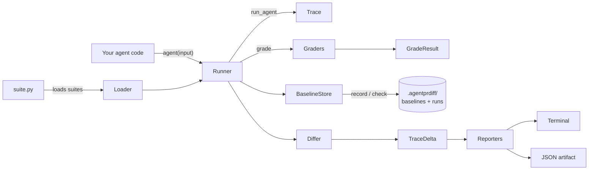

# Overview

`agentprdiff` is a Python library and CLI for **snapshot testing of LLM
agents**. It records what your agent did on a known-good run, commits that
record to git, and on every subsequent run computes a structured *trace
delta* — pass/fail flips, cost change, latency change, tool-call sequence
changes, and a unified text diff of the final output. If anything regressed,
the CLI exits non-zero and your CI build fails.

> Despite the name, `agentprdiff` does not parse GitHub pull-request diffs.
> It produces the diff that a PR reviewer needs in order to reason about an
> agent change: *what did the agent used to do, what does it do now, and
> which assertions about its behavior just flipped?*

## What problem does it solve?

Three problems collapse into one:

1. **You can't unit-test a stochastic system.** Asserting `output == expected`
   on an LLM call is wrong by construction.
2. **LLM-as-judge evals are too slow and too expensive to run on every PR.**
   They're great for offline benchmarking, not for the inner-loop CI gate.
3. **Hidden behavioral drift ships to production.** A model bump from
   `gpt-4o` to `gpt-4o-mini`, a rewritten system prompt, or a vendor swap
   silently changes which tool fires, what gets quoted to the user, or how
   much a query costs — and you find out from the support queue.

`agentprdiff` sits in the middle. The 80 % of agent behavior you can encode
as deterministic rules ("the `lookup_order` tool was called", "the word
*refund* appeared", "cost stayed under $0.02") becomes a fast, free,
deterministic CI check. The 20 % that needs judgment becomes a `semantic()`
grader with a pluggable LLM judge — and a `fake_judge` fallback so CI stays
green without API keys.

## Why it exists

> You upgraded Claude. You tweaked a system prompt. You swapped `gpt-4o`
> for `gpt-4o-mini` in the cheap path. Which of your agent's behaviors just
> changed? `agentprdiff` tells you — before the PR merges.

It is *not* a framework. Your agent stays exactly the way it is.
`agentprdiff` records what it did, lets you assert what should be true about
what it did, and compares runs across time.

## Key features

| Capability | What it gives you |
|---|---|
| Tiny `Suite` / `Case` model | One Python file, no DSL, no YAML. |
| Ten batteries-included graders | `contains`, `contains_any`, `regex_match`, `tool_called`, `tool_sequence`, `no_tool_called`, `output_length_lt`, `latency_lt_ms`, `cost_lt_usd`, `semantic`. |
| Pluggable LLM judge | OpenAI, Anthropic, custom callable, or a deterministic `fake_judge`. |
| JSON baseline store | Committed under `.agentprdiff/baselines/`; reviewers see the diff in PRs. |
| Trace differ | Per-case `TraceDelta`: assertion changes, cost / latency / token deltas, tool-sequence diff, unified output diff. |
| Five-command CLI | `init`, `record`, `check`, `review`, `scaffold`, `diff`. |
| OpenAI + Anthropic SDK adapters | One `with` block auto-records every model and tool call (sync **and** async OpenAI). |
| OpenAI-compatible providers | Groq, Gemini, OpenRouter, Ollama, vLLM, Together, Fireworks, DeepInfra. |
| Case filters | `--case`, `--skip`, globs, negation, `--list` — *like `pytest -k`*. |
| Local iteration loop | `agentprdiff review` always exits 0 with a verbose per-case panel. |
| CI-friendly outputs | Rich terminal table, `--json-out` artifact, exit 1 on regression. |

## High-level architecture

The path through the system on a single CLI invocation is:

1. **Loader** imports your suite file and harvests every module-level `Suite`.
2. **Runner** invokes `agent(case.input)` for each case, building a `Trace`.
3. **Graders** run against the resulting trace, producing `GradeResult`s.
4. **BaselineStore** either *saves* (`record` mode) or *loads* (`check` mode)
   the baseline JSON for that suite/case.
5. **Differ** computes a `TraceDelta` (cost / latency / tokens / tool sequence
   / output / per-grader pass-fail flips).
6. **Reporters** render to the terminal and optionally to a JSON artifact.
7. The CLI exits `1` when any case has a regression (pass→fail flip, new
   exception, missing baseline + failing assertion).

## Where to next

- New here? Jump to the [Quickstart](./quickstart.md).
- Curious about the design? [Core concepts](./concepts.md).
- Want runnable patterns? [Scenarios & examples](./scenarios/simple-suite.md).
- Looking for a function or flag? [API](./api/python.md) or
  [CLI reference](./api/cli.md).
