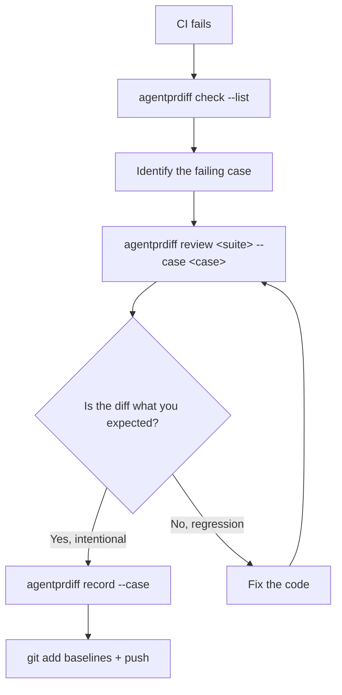

# Scenario 7 — Debugging a Failing Case

When `agentprdiff check` exits 1 and you need to figure out why, *fast*.

## The five-minute loop



## Step 1 — Read the table

The CI log shows which cases regressed and the headline reason for each:

```
agentprdiff check — suite billing  (3/4 passed, 1 regressed)
┏━━━━━━━━━━━━━━━━━━━━━━━━━━━━━━┳━━━━━━━━━━━━┳━━━━━━━━┳━━━━━━━━━┳━━━━━━━━━━━━━━━━━━━━━━━━━━━━━━━━━━━━━━━┓
┃ Case                          ┃ Result     ┃ Cost Δ ┃ Latency ┃ Notes                                  ┃
┡━━━━━━━━━━━━━━━━━━━━━━━━━━━━━━╇━━━━━━━━━━━━╇━━━━━━━━╇━━━━━━━━━╇━━━━━━━━━━━━━━━━━━━━━━━━━━━━━━━━━━━━━━━┩
│ refund_happy_path             │ REGRESSION │  +$.02 │ +180 ms │ tools: ['lookup_order'] → []           │
│                               │            │        │         │ output changed                         │
│                               │            │        │         │ tool_called('lookup_order') 0/1        │
└───────────────────────────────┴────────────┴────────┴─────────┴────────────────────────────────────────┘
```

Three signals already visible:

- The agent **stopped calling** `lookup_order`.
- The output **changed** (unified diff is in the panel below the table).
- Cost went **up** by 2¢ (likely because the prompt got longer when the
  tool stopped firing).

## Step 2 — Reproduce locally with `review`

```bash
agentprdiff review billing/suite.py --case refund_happy_path
```

`review` runs the same comparison as `check` but renders one verbose panel
per case — input echo, every assertion's *was → now* verdict, cost /
latency / token deltas, tool-sequence diff, unified output diff — and
**always exits 0** so you can pipe it into a watcher.

```
╭ case: refund_happy_path ───────────────────────────────────────────────────╮
│ suite: billing    status: REGRESSION    baseline: present                  │
│                                                                            │
│ input:                                                                     │
│   I want a refund for order #1234                                          │
│                                                                            │
│ assertions:                                                                │
│ was → now grader                                  reason                   │
│  ✓  →  ✗   tool_called('lookup_order', min_times=1) tool 'lookup_order'   │
│            (regression)                            called 0 time(s),       │
│                                                    required >= 1           │
│  ✓  →  ✓   contains('refund')                      output contains 'refund'│
│  ✓  →  ✓   latency_lt_ms(5000.0)                   latency 612.3 ms,       │
│                                                    limit 5000.0 ms         │
│                                                                            │
│ metrics:                                                                   │
│   cost           +0.0203 USD                                               │
│   latency        +180.5 ms                                                 │
│   prompt tokens  +412                                                      │
│                                                                            │
│ tools:                                                                     │
│   baseline: ['lookup_order']                                               │
│   current:  []                                                             │
│                                                                            │
│ output:                                                                    │
│   ╭────────────────────────────────────────────────────────────────────╮  │
│   │ --- baseline                                                       │  │
│   │ +++ current                                                        │  │
│   │ @@ -1 +1 @@                                                        │  │
│   │ -Refund of $89.00 processed; expect it in 3–5 business days.       │  │
│   │ +Could you share your order number so I can look up your order?    │  │
│   ╰────────────────────────────────────────────────────────────────────╯  │
╰────────────────────────────────────────────────────────────────────────────╯
```

Now you know:

- The model stopped extracting `1234` from the user's message.
- That made the agent ask for the order number (which is why no tool
  was called).
- The token count and cost jumped because of the longer clarification
  prompt.

The likely culprit is something in the model upgrade or prompt rewrite that
broke entity extraction. You're 60 seconds in.

## Step 3 — Inspect the saved baseline

```bash
agentprdiff diff billing refund_happy_path
```

This pretty-prints the saved baseline JSON to stdout. Combine with `jq`
for surgical reads:

```bash
agentprdiff diff billing refund_happy_path | jq '.tool_calls'
```

```json
[
  {
    "name": "lookup_order",
    "arguments": {"order_id": "1234"},
    "result": {"status": "delivered", "amount_usd": 89.0},
    "latency_ms": 8.1,
    "error": null
  }
]
```

This is the *baseline* — what the agent used to do. Compare to the run
trace under `.agentprdiff/runs/<timestamp>/billing/refund_happy_path.json`
for what just happened.

## Step 4 — Iterate with a watcher

```bash
ls billing/agent.py billing/suite.py | entr -c \
    agentprdiff review billing/suite.py --case refund_happy_path
```

Save → see the panel update. `review` exits 0 even on regression so the
shell stays usable.

## Step 5 — Decide: regression or intentional?

| You concluded… | Do this |
|---|---|
| "This was a model regression — `gpt-4o-mini` can't extract this entity reliably." | Revert the model swap, or pin the affected case to `gpt-4o` only and re-run `record`. |
| "We genuinely changed the prompt to ask follow-up questions instead of guessing." | Re-record the baseline and update reviewers in the PR. |
| "Stub data drifted; the test is wrong." | Fix `_stubs.py`, re-record, commit. |

Re-recording the baseline:

```bash
agentprdiff record billing/suite.py --case refund_happy_path
git add .agentprdiff/baselines/billing/refund_happy_path.json
git commit -m "agent: ask for order number when extraction fails"
```

The git diff in `.agentprdiff/baselines/` is the review surface.
Reviewers see *exactly* the trace fields that changed.

## Common diagnoses

| What the panel shows | Most likely cause |
|---|---|
| `tools: [...] → []` | Model stopped calling tools — bad system prompt or model regression. |
| `tools: [a, b] → [a, c, b]` | A new tool was added; check `tool_sequence(strict=True)` cases. |
| Output diff is wholly different | Hallucination or prompt rewrite. Check the `LLMCall.input_messages` in baseline vs run. |
| Cost up, latency up, tokens up | Prompt blew up — check for a runaway `for`-loop in your few-shot examples. |
| `error: ...` in Notes | Agent raised. Check stderr in the workflow log; the exception type is recorded too. |
| `regex_match('\S')` newly failing | Empty / whitespace output — usually a downstream parsing change. |

## When `agentprdiff` itself seems wrong

Two things to try first:

1. **Re-run with a minimal filter.** `agentprdiff review --case <one>`
   eliminates noise from sibling cases.
2. **Inspect the run JSON.** `cat .agentprdiff/runs/<latest>/<suite>/<case>.json`
   shows the exact trace the differ used. If the trace doesn't contain
   what you think it should, the bug is in your *agent* (or its
   instrumentation), not in `agentprdiff`.

If you've narrowed it down to an `agentprdiff` issue, see
[Troubleshooting](../troubleshooting.md) for known issues and the file/line
to grep.
